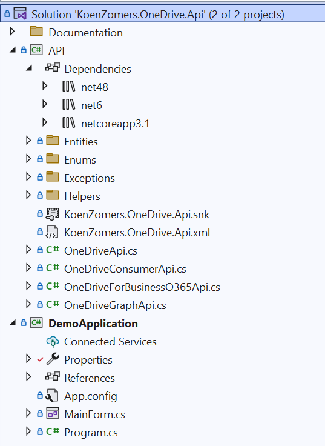

# OneDriveAPI
OneDrive API in .NET Standard 2.0, .NET Framework 4.5.2, .NET Framework 4.7.2 and .NET Core 2.0

 [](http://makeapullrequest.com)

Easy to use lightweight framework to communicate with the OneDrive Personal and OneDrive for Business through either the Azure AD (api.onedrive.com & tenant-my.sharepoint.com/_api or the Azure AD V2.0 (graph.microsoft.com) endpoint. It allows communication through one unified piece of code with:

- OneDrive Personal
- OneDrive for Business
- SharePoint Online (yet to come, work in progess)
- SharePoint Server 2016 (yet to come, work in progess)

The code contains a fully working demo Windows Forms application which shows you exactly how to use all of the functionality exposed in the OneDrive API.



To get an instance to a OneDrive or OneDrive for Business through the Microsoft Graph API using Azure AD v2.0 (recommended), simply use:

```C#
KoenZomers.OneDrive.Api oneDrive = new OneDriveGraphApi(applicationId);
```

OR to get an instance to a OneDrive Consumer account, simply use:

```C#
KoenZomers.OneDrive.Api oneDrive = new OneDriveConsumerApi(clientId, clientSecret);
```

OR to get an instance to a OneDrive for Business account, simply use:

```C#
KoenZomers.OneDrive.Api oneDrive = new OneDriveForBusinessO365Api(clientId, clientSecret);
```

!! Notice: Microsoft will turn off the Office 365 Discovery API on November 1, 2019 which is being used by the OneDrive for Business Api. Use the OneDriveGraphApi instead to avoid your application to stop working on this date !!

If you're not sure which of these to use, go with the Microsoft Graph using the Azure AD v2.0 endpoint.

If you want it to work through a HTTPS proxy, simply provide the proxy configuration by setting the ProxyConfiguration property:

```C#
oneDrive.ProxyConfiguration = System.Net.WebRequest.DefaultWebProxy;
```

In order to get a new access token from the refresh token you already got from authenticating to OneDrive or OneDrive for Business, simply use:

```C#
oneDrive.AuthenticateUsingRefreshToken("yourrefreshtoken");
```

If you don't have a refresh token yet, you will have to go through an interactive browser logon to perform authentication and get the refresh token. Check the DemoApplication to see how this works.

Once you have an authenticated OneDrive session, you can simply use for example:

- Getting all files in the root: _oneDrive.GetDriveRootChildren();_
- Downloading a file: _oneDrive.DownloadItemAndSaveAs("fileOnOneDrive.txt", "c:\temp\file.txt");_
- Uploading a file: _oneDrive.UploadFile("c:\temp\file.txt", "fileOnOneDrive.txt");_
- And many more operations...

Let me know in case you run into other things that no longer work because of this update and I'll be happy to look into it.

## Available via NuGet
You can also pull this API in as a NuGet package by adding "KoenZomers.OneDrive.Api" or running:

Install-Package KoenZomers.OneDrive.Api

Package statistics:
https://www.nuget.org/packages/KoenZomers.OneDrive.Api

## Version History

2.3.1.0 - October 27, 2019

- Merged [PR 20](https://github.com/KoenZomers/OneDriveAPI/pull/20) to allow for providing a client secret with the OneDrive Graph API

2.3.0.2 - May 16, 2019

- Fixed a bug when uploading files larger than 5 MB throwing an exception stating that the oneDriveUploadSession is NULL

2.3.0.1 - May 5, 2019

- Recompiled to support multi platform to support .NET Standard 2.0, .NET Framework 4.5.2, .NET Framework 4.7.2 and .NET Core 2.0
- Downgraded Newtonsoft JSON version requirement to be 11.0.1 and higher for .NET Core and .NET Standard and 8.0.1 for .NET Framework to allow for a bit greater compatibility

2.2.1.0 - May 5, 2019

- Added several UpdateFile methods to allow for updating the contents of an existing file. The normal UploadFile throws an exception in some cases if you try to upload a file to the same location, especially when the item is shared with the user and resides on another drive. To aid in that scenario, use the UpdateFile methods
- Added OneDriveSharedItem entity which will expose information on the owner of a shared item
- Several smaller fixes

2.2.0.0 - March 3, 2019

- Converted the API from the .NET Framework to .NET Standard 2.0 so it can also be used on non Windows environments
- Upgraded to use Newtonsoft JSON 12.0.1
- Upgraded the Demo Application to use a proper namespace and be compiled against the .NET Framework 4.6.2 instead of 4.5.2

2.1.2.1 - February 17, 2019

- Fixed bug in OneDrive for Business provider causing an error like "OAuth2 Authorization code was already redeemed" introduced by an API change on the Microsoft side when trying to authenticate

2.1.1.0 - January 4, 2019

- Fixed a typo in NameConflictBeha*v*iorAnnotation. Thanks to Daniel Ethier for reporting this.
- Implemented the ability to specify the NameConflictBehavior when uploading a file. The enumerator provides the option to overwrite the existing file, rename the file that is being uploaded or to fail the upload in the situation where a similarly named file already exists in the target location on OneDrive. Note that the SimpleUpload method does not support providing a NameConflictBehavior so it will always use the ResumableUpload method. It is also only implemented for the Graph API, so ensure to cast your oneDrive instace to OneDriveGraphApi to see the new argument.
- Included the documentation XML file which should bring the inline comments to your application from where you add the NuGet or assembly reference

2.1.0.1 - January 12, 2018

- Bufixes in uploading

2.1.0.0 - January 11, 2018

- Various bugfixes
- Mayor updates to most of the methods to properly support working with shared items from other drives
- NOTICE: This version is not 100% backwards compatible with the previous version. To enable the shared items functionality to work I had to break through the golden rule to try to keep backwards compatibility. The changes required to your code should be minimal though.

2.0.4.3 - January 5, 2018

- Fixed issue with ShareItem methods returning NULL if the item was already shared
- Added option to provide a OneDriveSharingScope to ShareItem when connecting through Graph API or to a OneDrive for Business to choose between an anonymous link or a link that only people in the same organisation can use. The scope is not supported with OneDrive Personal.

2.0.4.2 - January 5, 2018

- Fixed issues with some methods using /sites/ while prepending /me

2.0.4.1 - January 5, 2018

- Modified all existing methods (i.e. get child items, renaming, copying) to also be able to handle items shared from another drive. Be sure to use the methods that accept a OneDriveItem type if you're dealing with shared items. Methods taking a string path are only for items stored on the current user its OneDrive.

2.0.4.0 - January 5, 2018

- Added the following methods to get items from items shared from other drives: GetDrive, GetChildrenFromDriveByFolderId, GetAllChildrenFromDriveByFolderId, GetItemFromDriveById
- Updated DownloadItem and all UploadItem methods to also work when providing a OneDriveItem which is retrieved through one of the above methods to download or upload an item residing on another drive
- Breaking change: GetSharedWithMe now returns a collection of OneDriveItem entities instead of the OneDriveSharedWithMeItem type. The OneDriveSharedWithMeItem type is no longer being used.

2.0.3.1 - December 31, 2017

- Bugfix: when you would provide proxy credentials but not a proxy server, the API would throw an exception when trying to connect

2.0.3.0 - October 31, 2017

- Added the following methods to work with [AppFolders](https://docs.microsoft.com/en-us/onedrive/developer/rest-api/concepts/special-folders-appfolder): GetAppFolderMetadata, GetAppFolderChildren, GetAllAppFolderChildren, CreateAppFolderFolder, GetAppFolderFolderOrCreate, UploadFileToAppFolder, UploadFileToAppFolderAs, UploadFileToAppFolderViaSimpleUpload, UploadFileToAppFolderViaResumableUpload. All of these only work when connecting through the Graph API. To download files from the AppFolder, you can use the regular DownloadItem methods. To upload a file to a subfolder of the AppFolder you can use the regular UploadFile methods.
- Added comments to the sourcecode behind every button in the demo application to explain what that specific button/scenario will do

2.0.2.0 - October 30, 2017

- Added the following methods to work with permissions on OneDrive items: AddPermission, ChangePermission, RemovePermission, ListPermissions. All of these only work when connecting through the Graph API.

2.0.1.0 - August 23, 2017

- Adjusted the functionality behind GetFolderOrCreate so that it also accepts multipaths. I.e. when you call GetFolderOrCreate("Files\Work\Contracts") it will now ensure that all the folders Files, Work and Contracts exist and return the instance of Contracts. Feature request from Vincent van Hulst.

2.0.0.0 - August 21, 2017

- Added support for utilizing the Microsoft Graph API to access files from both Consumer OneDrive as well as OneDrive for Business sites through 1 unified authentication process
- Changed the default limit for deciding between the Simple Upload and Resumable Upload from 5 MB to 4 MB [as per Microsoft recommendations](https://dev.onedrive.com/items/upload_put.htm)
- All methods in the base OneDrive class are now virtual so you can easily override them in your inherited code if you wish to do so
- Added methods to query for basic SharePoint Online site data as exposed by the [Graph API v1.0](https://developer.microsoft.com/en-us/graph/docs/api-reference/v1.0/resources/sharepoint). Only the beta of the Graph API supports working with list items and files on SharePoint Online. As the beta is not intended for production use, I haven't implemented these methods.

[Version History](./VersionHistory.md)

## Register your own Client ID

If you wish to use the OneDrive API through the Microsoft Graph API, you need to register your own Client ID. Follow the steps below to do so.

1. Go to https://portal.azure.com/#blade/Microsoft_AAD_RegisteredApps/ApplicationsListBlade
2. At the top, click on New registration
3. Enter any name for the application that you would like
4. Under _Supported account types_ select _Accounts in any organizational directory (Any Azure AD directory - Multitenant) and personal Microsoft accounts (e.g. Skype, Xbox)_
5. Under _Platform configuration_ select _Client Application_
6. Hit the _Register_ button at the bottom
7. Click on _Add a platform_ followed by clicking on _Mobile and desktop applications_
8. Select the two proposed options for _https://login.microsoftonline.com/common/oauth2/nativeclient_ and _https://login.live.com/oauth20_desktop.srf_ and click on _Configure_ at the bottom
9. In the left menu bar, click on _Overview_
10. Copy the _Application (client) ID_ from the section at the top
11. Set the [ClientId](https://github.com/KoenZomers/OneDriveAPI/blob/f32d39891614d47efc9b5cb50d9500ca239751a0/Api/OneDriveApi.cs#L28) through your code to the application ID retrieved at the previous step. If you want to use the DemoApplication included with this code to test your new application registration, open its App.config file and replace the value for `<add key="GraphApiApplicationId" value="5bbbcf45-3ca9-47cf-8c2f-0ecdcf587332"/>` with the application ID retrieved at the previous step.
12. Run the demo application, select "Graph API (Consumer & Business)" and click on "Authorize"

## Feedback

Feedback is very welcome. If you believe something is not working well or could be improved, feel free to drop me an e-mail or [create an issue](https://github.com/KoenZomers/OneDriveAPI/issues).

Koen Zomers
koen@zomers.eu
