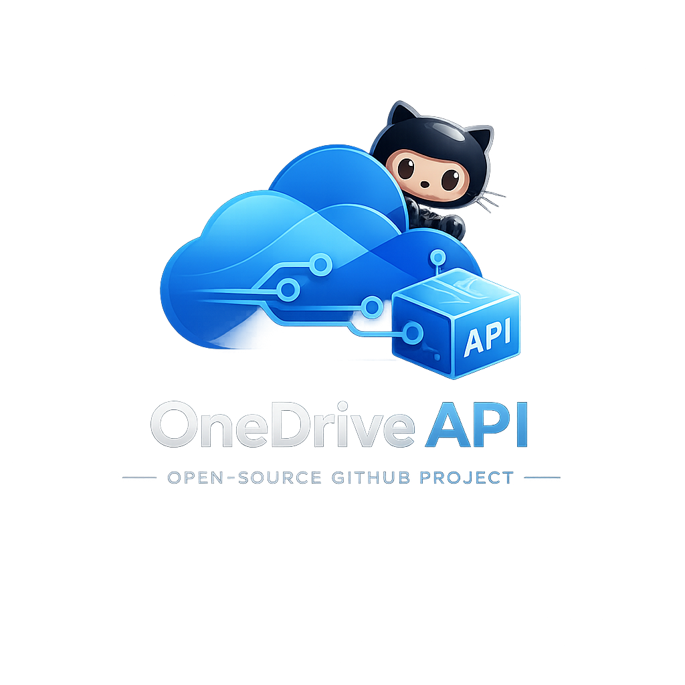

# OneDriveAPI



OneDrive API in .NET Standard 2.0 and .NET 8.0

 [](http://makeapullrequest.com)

Easy to use lightweight framework to communicate with OneDrive Personal, OneDrive for Business and Microsoft 365 through the Microsoft Graph API (graph.microsoft.com). Authentication is handled through the [Microsoft Authentication Library (MSAL.NET)](https://www.nuget.org/packages/Microsoft.Identity.Client), giving you the flexibility to use any Microsoft Entra ID authentication flow (interactive, device code, authorization code, silent, refresh token migration, client credentials).

> ⚠️ **Version 3.0.0.0 is a major, breaking release.** Authentication has been migrated to MSAL. `OneDriveConsumerApi` (the legacy Live Connect based OneDrive Personal API) and `OneDriveForBusinessO365Api` (the legacy SharePoint REST v2.0 endpoint) have both been removed in favor of `OneDriveGraphApi`, per Microsoft's guidance that all SharePoint/OneDrive REST innovation is now driven through the Microsoft Graph API. See [CHANGELOG.md](CHANGELOG.md) for full details and migration guidance.

The code contains a fully working demo Windows Forms application which shows you exactly how to use all of the functionality exposed in the OneDrive API.

To get an instance to a Personal OneDrive or OneDrive for Business through the Microsoft Graph API using Microsoft Entra ID, simply use:

```C#
KoenZomers.OneDrive.Api oneDrive = new OneDriveGraphApi(applicationId);
```

### Authentication

`OneDriveGraphApi` exposes the underlying MSAL client application so you can use **any** MSAL-supported authentication flow, not just the ones wrapped by this library:

- `oneDrive.PublicClientApplication` - populated when no client secret is configured (e.g. `OneDriveGraphApi` without a secret). Use this for `AcquireTokenInteractive`, `AcquireTokenByDeviceCode`, `AcquireTokenSilent`, etc.
- `oneDrive.ConfidentialClientApplication` - populated when a client secret is configured. Use this for `AcquireTokenByAuthorizationCode`, `AcquireTokenForClient` (app-only), `AcquireTokenSilent`, etc.

After calling any MSAL flow directly, feed the result back into the library so it can be used for subsequent API calls and silent renewal:

```C#
var result = await oneDrive.PublicClientApplication.AcquireTokenInteractive(oneDrive.GetDefaultScopes()).ExecuteAsync();
oneDrive.SetAuthenticationResult(result);
```

For convenience, the library also wraps the most common flows:

```C#
// Authorization code flow (confidential client only - a client secret must be configured)
var authenticateUri = await oneDrive.GetAuthenticationUri();
// ... redirect the user to authenticateUri, capture the redirect callback URL ...
var code = oneDrive.GetAuthorizationTokenFromUrl(callbackUrl);
await oneDrive.AuthenticateUsingAuthorizationCode(code);

// Refresh token migration (e.g. migrating a refresh token obtained outside of MSAL)
await oneDrive.AuthenticateUsingRefreshToken("yourrefreshtoken");
```

Check the DemoApplication to see both patterns in action.

If you want it to work through a HTTPS proxy, simply provide the proxy configuration by setting the ProxyConfiguration property:

```C#
oneDrive.ProxyConfiguration = System.Net.WebRequest.DefaultWebProxy;
```

Once you have an authenticated OneDrive session, you can simply use for example:

- Getting all files in the root: _oneDrive.GetDriveRootChildren();_
- Downloading a file: _oneDrive.DownloadItemAndSaveAs("fileOnOneDrive.txt", "c:\temp\file.txt");_
- Uploading a file: _oneDrive.UploadFile("c:\temp\file.txt", "fileOnOneDrive.txt");_
- And many more operations...

Let me know in case you run into other things that no longer work because of this update and I'll be happy to look into it.

## Available via NuGet
You can also pull this API in as a NuGet package by adding "KoenZomers.OneDrive.Api" or running:

Install-Package KoenZomers.OneDrive.Api

Package statistics:
https://www.nuget.org/packages/KoenZomers.OneDrive.Api

## Version History

See [CHANGELOG.md](CHANGELOG.md) for the 3.0.0.0 release notes and MSAL migration guidance.

## Register your own Client ID

If you wish to use the OneDrive API through the Microsoft Graph API, you need to register your own Client ID. Follow the steps below to do so.

1. Go to https://entra.microsoft.com and navigate to _Applications > App registrations_
2. At the top, click on New registration
3. Enter any name for the application that you would like
4. Under _Supported account types_ select _Accounts in any organizational directory (Any Microsoft Entra ID directory - Multitenant) and personal Microsoft accounts (e.g. Skype, Xbox)_
5. Under _Platform configuration_ select _Public client/native (mobile & desktop)_
6. Hit the _Register_ button at the bottom
7. Click on _Add a platform_ followed by clicking on _Mobile and desktop applications_
8. Enter the redirect URI _http://localhost_ (this is what this library uses by default; MSAL automatically picks a free port on this loopback address for its interactive/authorization-code flows) and click on _Configure_ at the bottom
8b. Under _Authentication_, make sure _Allow public client flows_ is set to _Yes_ (required for the interactive sign-in flow used by the Demo application)
9. In the left menu bar, click on _Overview_
10. Copy the _Application (client) ID_ from the section at the top
11. Set the [ClientId](https://github.com/KoenZomers/OneDriveAPI/blob/master/Api/OneDriveApi.cs) through your code to the application ID retrieved at the previous step. If you want to use the DemoApplication included with this code to test your new application registration, open its App.config file and replace the value for `<add key="GraphApiApplicationId" value="5bbbcf45-3ca9-47cf-8c2f-0ecdcf587332"/>` with the application ID retrieved at the previous step.
12. Run the demo application and click on "Authorize"

Please do not reuse the Client ID that is included in this library. It is only for testing purposes and can be removed at any time and should therefore not be used in production.

## Feedback

Feedback is very welcome. If you believe something is not working well or could be improved, feel free to drop me an e-mail or [create an issue](https://github.com/KoenZomers/OneDriveAPI/issues).

Koen Zomers
koen@zomers.eu
